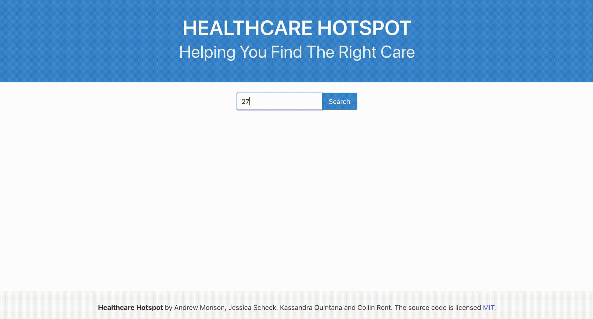

# healthcare-hotspot



## Project Breakdown

Design team:
[Kassandra Quintana](https://github.com/kassandraq), [Colin Rent](https://github.com/Crent99)

Functionality team:
[Andrew Monson](https://github.com/AndrewCMonson) and [Jessica Scheck](https://github.com/Jessmica11)

## User Story

```md
AS a user without a healthcare provider
I WANT to input my zipcode/location information
SO THAT I can have a list of healthcare providers near me and their contact information
```

## Acceptance Criteria

```md
GIVEN I am looking for a healthcare provider
WHEN I open the tool
THEN I can unput my zipcode
WHEN I submit my personal location
THEN I am presented with multiple healthcare providers within my location range with their contact information
```

## Project Parameters

### MUST use 2 APIs

API 1:
[Ziptastic](https://www.ziptasticAPI.com/)

API 2:
[National Plan & Provider Enumeration System (NPPES) ](https://npiregistry.cms.hhs.gov/api-page)

### MUST use CSS framework other than Bootstrap

Chosen CSS framework: [Bulma](https://bulma.io/)

## Project Challenges & Solutions

Functionality Team:
Since we knew we needed to pull a few different pieces of data to create the healthcare provider contact information, we decided to work off of object-oriented programming. Our javascript relies on our defined object variables holding data from the API arrays, simplifying our approach compared to using many different functions.

### Challenges & Solutions

#### Challenge 1

One of our original challenges while developing the javascript functionality revolved around how the API data was created. It's fairly common for healthcare providers to either register their information under a specific first and last name format OR an organization name. When we initially built our object of pulled data, we realized that when we looped through the arrays, our call would stop if there was no first (and by relation, no last name).

If the API call returned a null for the first name field, it would stop processing the other object arrays within the results array [i].

We were finally able to resolve this by specifying if and else statements as the call would run; IF there was a provider first name, continue calling the other previously defined object arrays and drop them into the variables we defined. ELSE specified that if the first object call was null, it would instead look for the other option: provider first name OR an organization name.

#### Challenge 2

For a better user experience we wanted to prevent as many user errors as possible. We wanted to prevent:

- false USA zipcodes
- different iterations of zipcode (5 digits versus a full 9-digit zipcode)
- letter input

We solved this by limiting the input use; the user is unable to use any keydown event that wasn't either a number key, "Enter," or "Backspace." This simplified our code so that we didn't have to develop for multiple error circumstances, as we prevented those errors at the very start. This also makes the app fairly error-proof for users, and is very clear when there is an error for false zipcode inputs (using a full window modal).
